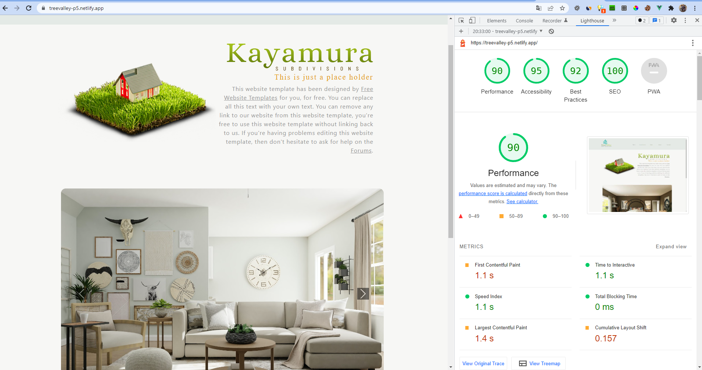

# TreeValley con Vue - P5

## Tabla de contenidos:
---
- [Descripción y contexto](#descripción-y-contexto)
- [Rendimiento del proyecto - Lighthouse](#rendimiento-del-proyecto-lighthouse)
- [Guía de usuario](#guía-de-usuario)
- [Mejoras del proyecto](#Mejoras-del-proyecto)
- [Color font pallete](#Color-and-font-pallete)
- [Despliegue](#Despliegue)
- [Autores](#Autores)


## Descripción y contexto
---
Desarollo de aplicación con Vue, utilizando componentes, vistas, router links, SCSSS y store para la persistencia de los datos sin recargar la página.

## Rendimiento del proyecto - Lighthouse
---
* 90 Performance
* 95 Accesibility
* 92 Best Practices
* 100 SEO

<p></p>

## Guía de usuario
---
### Principios de usabilidad y accesibilidad aplicados en las secciones _/shop_ y _/checkout_

<h3>UX</h3>
_**1. Visual**_
* Definida paleta de colores en toda la web.
* Principios de diseño gráfico aplicados en toda la web.

_**2. Claridad**_
* Interfície no cargada de elementos en la sección shop. También se ha incluído en carrousel de fotos en la home sin generar impacto sobre la versión de la ohme anterior.
* Imágenes con calidad adecuada a la situación. El tamaño no afecta a la performance y la calidad evita tener contenido pixelado.
* Descripciones cortas y concisas en los elementos de la web
* Lenguaje visual e intuitivo.

_**3. Ayuda al usuario**_
* Información en el proceso de compra. Se ha decidido generar el checkout en dos pasos: uno para introducir los datos y otra par informar del pedido realizado.


<h3>Accesibilidad</h3>
* Aplicadas etiquetas semánticas en las vistas del proyecto de Vue.
* Uso de encabezados distinguidos (h1, h2, h3, …).
* Cambio de color en los botones en el hover en el proceso de compra.
* Validación en el lado cliente, formulario de checkout.


## Bootstrap
---

### Componentes de Bootstrap:
- NAVBAR: Barra de navegación.<br>
- COLLAPSE: Barra de navegación con menú desplegables.<br>
- BUTTONS: Boton de acción para desplegar el menú. <br>
- BADGES: Señala las views del blog.<br>
- CARDS: Tarjetas de información del blog.

### Bootstrap Utilities:
- Background<br>
- Display<br>
- Grid<br>
- Flex<br>
- Float<br>
- Position<br>
- Spacing<br>
- Text

### Customización:

Customización de colores y estilos en el custom.scss
Se han cambiado algunos colores de Bootstrap por colores propios y se han añadido algunos estilos.

## Otras mejoras del proyecto
---
- Se han hecho todas las páginas extras también con Vue.
- La web es responsive, adaptable y fluida.
- Proceso de compra realizado en dos pasos (_/checkout y /purchase_) para facilitar la experiencia y las landings.
- Header editado en el proceso de compra para limitar la navegación del usuario
- Diferentes imágenes en cada producto en la landing de compra (_/shop_)
- El carrito de compra solo aparece con detalles cuando al menos hay un objeto. En caso contrario se muestra el mensaje de que está vacío.

## Color and font Pallete
- La paleta de colores utilizadas es la siguiente:
<p></p>


## Despliegue

El netlify: https://treevalley-p5.netlify.app/

## Autores

- Juan Ignacio Akrich Vazquez
- Toni García García


# treevalley-p5-pc5

## Project setup
```
npm install
```

### Compiles and hot-reloads for development
```
npm run serve
```

### Compiles and minifies for production
```
npm run build
```

### Lints and fixes files
```
npm run lint
```

### Customize configuration
See [Configuration Reference](https://cli.vuejs.org/config/).
